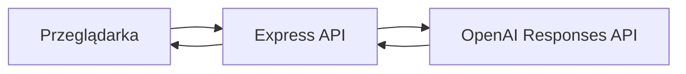

# Architecture

## MVP

- statyczny frontend: HTML, CSS i JavaScript;
- pojedynczy serwer Node.js/Express;
- klucz API dostępny tylko w procesie serwera;
- brak bazy danych, logowania treści i kont użytkowników;
- rejestry standardu w JSON;
- wynik zwracany jako gotowy Markdown.

## Granice

MVP nie przechowuje historii, nie obsługuje plików, kont, płatności,
strumieniowania ani wielu dostawców modeli.
